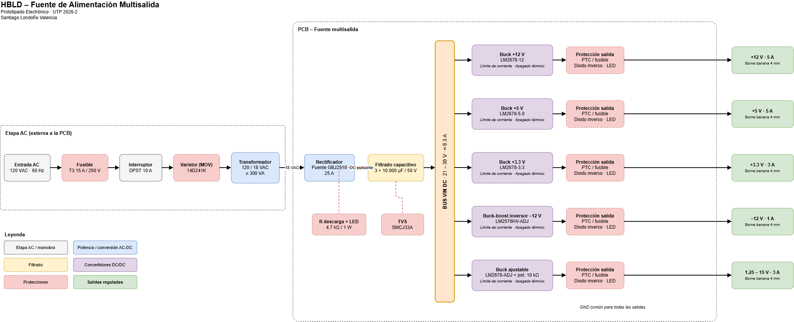

# 🧩 Diagrama de Bloques de Alto Nivel (HBLD)

**Fuente de Alimentación Multisalida** · Prototipado Electrónico · UTP 2026-2

---

  

---

### 📖 Cómo leer el diagrama

| Color | Bloque |
|:---:|---|
| ⬜ | Etapa AC y maniobra |
| 🟦 | Potencia / conversión AC-DC |
| 🟨 | Filtrado |
| 🟪 | Convertidores DC/DC |
| 🟥 | Protecciones |
| 🟩 | Salidas reguladas |

### ✏️ Editar el diagrama

Descarga el archivo `.drawio` y ábrelo en [app.diagrams.net](https://app.diagrams.net) desde **Archivo → Abrir desde → Dispositivo**.

⬅️ [Volver a la documentación](../README.md)
